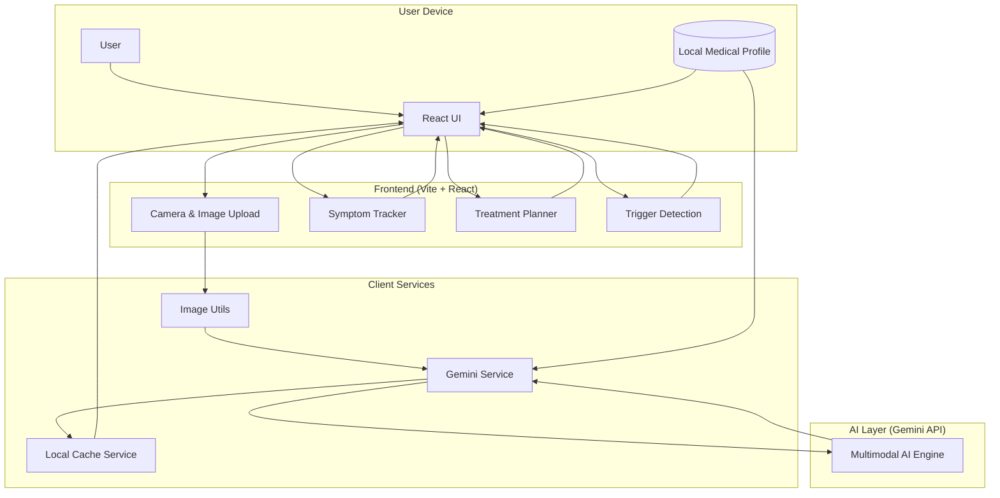

# 🩺 LifeLens — A Context-Aware AI Health Companion


**LifeLens** is a personal AI health companion focused on **trust, safety, and context**.  
It helps users make sense of health signals — such as **skin changes, food-related concerns, or symptoms** — using images and basic medical context, **without providing diagnoses**.

🔗 **Live Demo (Early Version)**  
https://life-lens-iota.vercel.app  
*(Free Gemini APIs are used for now, so public usage limits may apply.)*

---

## 🧠 Philosophy — Trust > Intelligence

LifeLens is not designed to replace doctors or make medical decisions.

Instead, it is built to:
- Help users **observe changes over time**
- Provide **structured, explainable insights**
- Support better judgment around **when consulting a doctor may be the right next step**

---

## 📸 What LifeLens Can Do

### 🧬 Image-Based Understanding
- Single & multi-image analysis (1–3 angles)
- Skin pattern detection with **confidence-aware severity**
- Skin zone mapping to reduce hallucinations

### 📊 Symptoms & Progress Tracking
- Capture a **baseline image** before starting care
- Compare with images after **5–7 days**
- Detect whether symptoms are improving, stable, or worsening
- Flag when **early doctor consultation may help**

### 🥗 Food & Condition-Aware Guidance
- Analyze food choices based on:
  - Declared medical conditions
  - Allergies & sensitivities
  - Ongoing symptoms
- Helps answer: *“Should I eat this or avoid it?”*  
  *(Guidance-only, non-diagnostic)*

### 🧭 Personalized, Safety-First Guidance
- Daily care routines (morning / night / weekly)
- Possible trigger identification (stress, diet, contact factors)
- Treatment planning **without prescriptions**

---

## 🔐 Context-First & Privacy-First

- Medical profile stored **locally on the user’s device**
- Supports:
  - Medical conditions
  - Allergies & sensitivities
  - Past history & treatments
- Session-isolated chats (no context leakage)
- Clear boundary between **AI support and human judgment**

---

## 🛠️ Tech Stack

| Layer | Technology |
|------|------------|
| Frontend | React + Vite |
| Styling | Tailwind CSS |
| AI | Google Gemini (Multimodal) |
| State | Local cache + session isolation |
| Deployment | Vercel |

---

### 🛠️ System Architecture



## 📁 Project Structure
```bash
src/
├── components/
│ ├── CameraModal.tsx
│ ├── ComparisonSlider.tsx
│ ├── HistoryDrawer.tsx
│ ├── InputSection.tsx
│ ├── ProfileModal.tsx
│ ├── ResultCards.tsx
│ ├── SkinZoneMap.tsx
│ ├── SymptomCompareModal.tsx
│ ├── SymptomTracker.tsx
│ ├── TreatmentPlannerModal.tsx
│ └── TriggerCard.tsx
│
├── hooks/
│ └── useTheme.ts
│
├── services/
│ ├── cacheService.ts
│ ├── geminiService.ts
│ └── imageUtils.ts
│
├── public/
│ └── favicon.png
│
├── App.tsx
├── index.tsx
├── index.html
├── index.css
└── metadata.json

```

---

## 🚀 Run Locally

### Prerequisites
- Node.js (v18+ recommended)

### Setup

```bash
npm install
```

### Create a .env.local file:
GEMINI_API_KEY=your_gemini_api_key

### Run the app:
```bash
npm run dev
```

Open: http://localhost:5173

### ⚠️ Disclaimer

LifeLens:

Does not diagnose diseases 
Does not replace medical professionals 
Is intended only for educational, observational, and decision-support purposes 
Always consult a qualified healthcare professional for medical advice.


## 👤 Author

**Rajeev Kumar** *Software Engineer | NIT Agartala | GlobalLogic*

<div align="left">

[](https://rajeev-portfolio-delta.vercel.app/)
[](https://www.linkedin.com/in/rajeevkumar-nita)
[](https://github.com/rajeevkumar-nita)
[](https://x.com/rajeevbuilds)
[](https://www.instagram.com/rajeev_kmr77/)
[](mailto:rajeev.nita2025@gmail.com)

</div>

---

### 📜 License
Distributed under the MIT License.

Developed with ❤️ by Rajeev Kumar